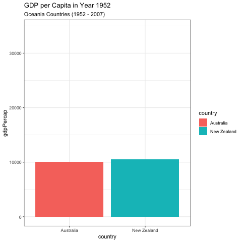
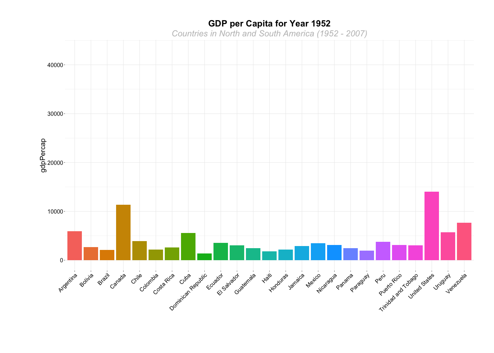

# Animated graphs

This page provides a brief explanation on how to make animated graphs. Animated graphs help present information that changes over a time period (such as years) or space (such as by state). They are one straightforward way of presenting three-dimensional data in a two-dimensional space.

## Keep in Mind

- Animated graphs can be in any shape: line, plot, bar, etc.
- Because the graph will be moving, it is often a good idea to start with a relatively simple graph. Otherwise the viewer can get overwhelmed.
- Carefully think about the duration of your animation and the number of frames to determine the speed and fluidity at which it moves.
- The height and width dimensions are important for presenting the animated details


## Also Consider

- You may need to do some data manipulation to create the right animated graph.
- Check the presentation [Figures]({{ "/Presentation/Figures/Figures.html" | relative_url }}), there are many charts we can animate. 


# Implementations

Notes on implementations: 

## R

There are many great packages to do animated graphs such as **gganimate** and **plotly**.

Here we use **gganimate** and **ggplot2** to do animated bar graphs, and **gifski** to save the results.

**gganimate** has the benefit of being able to animate any graph made in **ggplot2**. This means that all the other graphs in the [Figures]({{ "/Presentation/Figures/Figures.html" | relative_url }}) section, which use **ggplot2** for the R implementations, can be animated using **gganimate**.

```r
# Load in necessary packages
library(ggplot2)
library(gganimate)
library(gifski)
library(dplyr)

# Load in desired data (gapminder)
library(gapminder)
```

**gganimate** works by taking standard **ggplot2** input and adding a `transition_` function which specifies what should change from frame to frame, and how. `transition_states()` is fairly easy to work with, as it simply takes an ordered variable and transitions from value to value of that variable. Here we use `year`, and so it will remake the graph for each year, and transition between them. `ease_aes()` specifies how to smoothly transition between states.

```r
graph_data1 <- gapminder  %>% filter(continent=="Oceania")

# first use ggplot for the graph 
ggplot(graph_data1, aes(x=country, y=gdpPercap, fill=country)) + 
  geom_bar(stat='identity') +
  theme_bw() + # then set the gganimate,
  transition_states( # to specify the transition, here we specify 
    year,
    transition_length = 2, # How long to spend on each transition
    state_length = 1) + # How long to spend in each state (these are relative values, not numbers of frames)
  ease_aes('sine-in-out') + # to control easing of aesthetics 
  labs(title = 'GDP per Capita in Year {closest_state}', # title with the timestamp period
  subtitle = 'Oceania Countries (1952 - 2007)') 
```



```r
anim_save("graph1.gif") # to save the graph as gif
```

Animation can be a good way to show changes over many groups at once.

```r
graph_data <- gapminder %>% filter(continent=="Americas")

# Plot bar graphs by country, we have 25 countries in the Americas, that hard to interpretation using one graph.
# this example shows how gganimate can create a nice animated graph even with that high number of countries 

graph_2 <- ggplot(graph_data, aes(x=country, y=gdpPercap, fill=country)) + 
  geom_bar(stat='identity') +
  theme_bw() + # gganimate specific bits:
  transition_states(
    year,
    transition_length = 2,
    state_length = 1) +
  ease_aes('sine-in-out')+ 
  theme(axis.text=element_blank(),
        axis.title.x=element_blank(),
        legend.position="center",
        panel.border=element_blank(),
        axis.title.y=element_text(size=20),
        axis.text.y = element_text(hjust=1, size=16),
        axis.text.x = element_text(angle = 45, hjust=1, size=16),
        plot.title=element_text(size=25, hjust=0.5, face="bold", colour="black", vjust=1),
        plot.subtitle=element_text(size=24, hjust=0.5, face="italic", color="grey"),
        plot.margin = margin(2, 2, 4, 4, "cm"))+ 
  labs(title = 'GDP per Capita for Year {closest_state}', # title with the timestamp period
  subtitle = 'Countries in North and South America (1952 - 2007)') 
```

Here, we've saved the graph as an object, so that we can use the `animate()` function to render it and save it as a GIF. This allows us to adjust animation settings like the number of frames or the frames per second.

```r
# The animated sitting, create an image per frame, in this example, we used year so it creates an image for each year
animate(graph_2, 100, fps = 20, end_pause=30,  width = 1400, height = 1000, 
        renderer = gifski_renderer("gganim1.gif"))
```



There are many other `transition_` functions. One useful option for line plots is `transition_reveal()`, which reveals only a part of the graph at a time until the entire graph is visible.

```r
# Plot North America, here we try line graph by only graph North America countries 
graph_data3 <- graph_data %>% filter(country %in% c("United States", "Canada", "Mexico"))

# Plot line graph
graph_3 <- ggplot(data = graph_data3) +
  geom_line(mapping = aes(x=year, y=lifeExp, color=country)) +
  theme_bw() +
  theme(legend.position = "right") +
  labs(title = 'Life Expectancy in North America (1952 - 2007)')+
    transition_reveal(year) + # Reveal data along a given dimension 
  ease_aes('linear') # The values change linearly during tweening
  
graph_3
```


```r
anim_save("graph_3.gif") # to save the graph as gif
```
